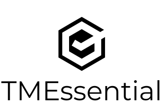

### Timiya系列插件交流&反馈群:1073980007

# [注意事项]
## 该插件使用GPL-3.0协议发行,请遵照协议使用此插件！

##### 本人建议使用lxl加载TA，因为NJS的就是一个兼容层）））
##### 使用NJS（NetJSR或者PFJSR）加载此插件时，请开启systemCmd！
##### 插件需要TA拓展接口！（getFilesList）
#
##### 多语言目前只内置了zh_CN语言
##### 但是可以自定义语言包
##### 也欢迎来翻译制作语言包，制作完成pr至 [WebLink](https://github.com/LiteLScript-Dev/TMEssential/) 即可
#
# [介绍]
##### 这是一个基于LiteXLoader的基础插件,但是内置NJS兼容
##### 两个加载器都可以加载它！但是我推荐用LXL加载它
##### （NJS兼容就是写着玩的，我也不知道有什么bug）
#
# [功能一览]
##### Economic_core(原数据支持)(在CSR-NJS环境下llmoney模式弃用)
##### (经济核心)
#
##### TPA(单TPA插件数据文件不用动)
##### (玩家互传)
#
##### HOME(单插件数据支持)
##### (家)
#
##### BACK(单插件数据支持)
##### (返回死亡点&记录死亡点)
#
##### WARP(单插件数据支持)
##### (公共传送点)
#
##### DynamicMotd
##### (动态服务器名称)
#
##### Notice(需要复制数据文件到TMETconfig)
##### (公告)
#
##### Shop(在CSR-NJS环境弃用).
##### (商店)
#
##### TPR
##### (随机传送)
#
##### ReloadChuck
##### (重新加载区块)
#
##### FarmLandProtect(在CSR-NJS环境弃用)
##### (耕地保护)

# [指令一览]
## 语言相关
##### /language //打开语言切换GUI
##### /language <input:LangPackName> //切换语言
#
## 玩家互传相关
##### /tpa //打开tpa面板
##### /tpahere //同上
##### /tpa gui //同上
##### /tpa ui //开启或者关闭别人发来的请求ui
##### /tpa <playerName> //请求传送到某人
##### /tpahere <playerName> //请求某人传送到自己
##### /tpaaccept //接受请求
##### /tpadeny //拒绝某人的请求或者取消自己的请求
#
## 家传送点相关
##### /home //打开home菜单
##### /home ls //查看家列表
##### /home go <homeName> //去往某个家
##### /home add <homeName> //添加一个家
##### /home del <homeName>  //删除某个家
##### /homeas //打开home管理菜单(op)
##### /homeas <playerName> ls //查看某人的家列表(op)
##### /homeas <playerName> go <homeName> //去往某人的某个家(op)
##### /homeas <playerName> add <homeName> //给某人添加一个家(op)
##### /homeas <playerName> del <homeName> //让某人痛失一个家(op)
#
## 公共传送点相关
##### /warp //打开warp菜单
##### /warp add <warpName> //添加一个传送点(op)
##### /warp ls //列出传送点
##### /warp go <warpName> //去往某传送点
##### /warp del <warpName> //删除某传送点(op)
#
## 玩家死亡相关
##### /back //前往最近的暴毙点
##### /death //查看前几次的暴毙信息
#
## 经济相关
##### /money //打开money表单
##### /money gui //同上
##### (以下命令是score经济才会有的指令)
##### /money pay <playerName> <Num>//给某人打钱
##### /money query [<playerName>]//查询自己或者某人的经济
##### /money add <playerName> <Num> //给某人添加经济(op)
##### /money set <playerName> <Num> //设置某人的经济(op)
##### /money reduce //扣除某人的经济(op)
#
## 公告相关
##### /notice //打开公告
##### /notice_op //编辑公告(op)
#
## 商店相关
##### /shop //打开商店总表单
##### /shop buy //打开买入表单
##### /shop sell //打开卖出表单
#
## 随机传送相关
##### /tpr //随机传送
#
## 刷新区块相关
##### /rc //刷新区块
#
## [配置文件]
### .\\plugins\\Timiya\\config\\TMEssential.json
#
## [语言包目录]
### .\\plugins\\Timiya\\lang
#
## [数据文件一览]
### [LANGUAGE]
##### .\\plugins\\Timiya\\data\\langsetting.json
#
### [TPA]
##### .\\plugins\\Timiya\\data\\tpasetting.json
#
### [HOME]
##### .\\plugins\\Timiya\\data\\homelist.json
#
### [BACK]
##### .\\plugins\\Timiya\\data\\deathlist.json
#
### [WARP]
##### .\\plugins\\Timiya\\data\\warplist.json
#
### [Money]
##### .\\plugins\\Timiya\\data\\offlineMoney.json
#
### [SHOP]
##### .\\plugins\\Timiya\\data\\shopdata.json
#
## [配置说明]
``` json
{
  "Enable": true,//总开关
  "LANGUAGE": {//多语言
    "Default": "zh_CN",//默认语言（注册命令用）
    "Cmd": "language"//切换语言命令
  },
  "TPA": {
    "Enable": true,//TPA开关
    "ExpirationTime": 40,//过期时间
    "ConsumeMoney": 0//消耗经济
  },
  "WARP": {
    "Enable": true,//地标开关
    "ConsumeMoney": 0//消耗经济
  },
  "BACK": {
    "Enable": true,//BACK开关
    "MaxSave": 5,//最大保存数量
    "SaveToFile": true,//保存到文件
    "InvincibleTime": 5,//回到死亡点后的无敌时间(s)
    "ConsumeMoney": 0//消耗经济
  },
  "HOME": {
    "Enable": true,//HOME开关
    "MaxHome": 10,//最大家数量
    "SaveRequiredMoney": 0,//保存所需经济
    "GoHomeRequiredMoney": 0,//前往所需经济
    "DelHomeBackOffMoney": 0//删除回退经济
  },
  "Money": {
    "Enable": true,//Money开关
    "MoneyType": "score",//经济类型["score","llmoney"]选填
    "MoneyName": "money",//经济名称
    "MoneyChangeMsg": true,//经济变动信息开关
    "PlayerInitialMoney": 0//玩家初始经济
  },
  "DYNAMICMOTD": {
    "Enable": true,//动态MOTD开关
    "Time": 5,//切换间隔(s)
    "Motds": [//MOTD列表,Array形式
      "§l§bTSC"
    ]
  },
  "NOTICE": {
    "Enable": true,//公告开关
    "JoinOpenNotice": true,//玩家加入自动打开公告开关
    "NoticeTitle": "title",//标题
    "NoticeText": "text"//内容
  },
  "SHOP": {
    "Enable": true//商店开关
  },
  "TPR": {
    "Enable": true,//TPR开关
    "MaxXZCoordinate": 10000,//最大的x和z轴随机距离
    "MinXZCoordinate": -10000,//最小的x和z轴随机距离
    "ConsumeMoney": 0//耗费经济
  },
  "ReloadChuck": {
    "Enable": true,//重新加载区块开关
    "ConsumeMoney": 0//耗费经济
  },[/INDENT]
  "FarmLandProtect": {
    "Enable": true,//耕地保护开关
    "Type": 0//类型(0全部拦截,1只拦截null对象造成耕地破坏,2只拦截非玩家破坏,3只拦截玩家破坏
  }
}
```
#
## [商店数据说明]
``` json
{
  "Buy": [//购买菜单
    {
      "type": "group",//类型【group为分类】
      "data": [//按钮数据【type为group为数组】
        {
          "name": "空气",//按钮名称
          "type": "exam",//类型【exam为商品】
          "data": {//数据【type为exam为物品对象】
            "type": "minecraft:air",//物品标准名
            "aux": 0,//物品特殊值
            "remark": "",//备注
            "money": 11//购买一个所需的经济
          }
        },
        {
          "name": "bread",//按钮名称
          "type": "exam",//类型【exam为商品】
          "data": {//数据【type为exam为物品对象】
            "type": "minecraft:bread",//物品标准名
            "aux": 0,//物品特殊值
            "remark": "",//备注
            "money": 2//购买一个所需的经济
          }
        }
     ]
    },
    {
      "name": "air",//按钮名称
      "type": "exam",//类型【exam为商品】
      "data": {//数据【type为exam为物品对象】
        "type": "minecraft:air",//物品标准名
        "aux": 0,//物品特殊值
        "remark": "",//备注
        "money": 11//购买一个所需的经济
      }
    }
  ],
  "Sell": [//卖出菜单
    {
      "name": "xx分类",//按钮名称
      "type": "group",//类型【group为分类】
      "data": [//按钮数据【type为group为数组】
        {
          "name": "空气",//按钮名称
          "type": "exam",//数据【type为exam为物品对象】
          "data": {//数据【type为exam为物品对象】
            "type": "minecraft:air",//物品标准名
            "aux": 0,//物品特殊值
            "remark": "",//备注
            "money": 11//回收一个获得得的经济
          }
        },
        {
          "name": "bread",//按钮名称
          "type": "exam",//数据【type为exam为物品对象】
          "data": {//数据【type为exam为物品对象】
            "type": "minecraft:bread",//物品标准名
            "aux": 0,//物品特殊值
            "remark": "",//备注
            "money": 1//回收一个获得得的经济
          }
        }
      ]
    },
    {
      "name": "redstone",//按钮名称
      "type": "exam",//数据【type为exam为物品对象】
      "data": {//数据【type为exam为物品对象】
        "type": "minecraft:redstone",//物品标准名
        "aux": 0,//物品特殊值
        "remark": "",//备注
        "money": 11//回收一个获得得的经济
      }
    }
  ]
}
```
#
*////////////////////////如何对接TMET//////////////////////////*
## JavaScript
``` javascript
let money = lxl.import('MONEY');//导入API
log(money('getmoney', 'mcllaop'));//获取并显示mcllaop的经济数据,如果没有或者错误就返回null(支持玩家离线)
log(money('setmoney', 'mcllaop', 5));//设置mcllaop的经济数据,一般返回布尔,错误返回null(支持玩家离线)
log(money('tranmoney', 'mcllaop', 'mciial', 5, '114514'));//让mcllaop给mciial转账,并且转账消息为114514(仅llmoney有效),一般返回布尔,错误返回null(支持玩家离线)
log(money('moneytype'));//获取经济类型,返回String
log(money('version'));//获取TMET版本返回FloatNumber
log(money('moneyname'));//获取货币名称返回String
```
#
## Lua
``` lua
money = lxl.import('MONEY')//导入API
print(money('getmoney', 'mcllaop'))//获取并显示mcllaop的经济数据,如果没有或者错误就返回null(支持玩家离线)
print(money('setmoney', 'mcllaop', 5)//设置mcllaop的经济数据,一般返回布尔,错误返回null(支持玩家离线)
print(money('tranmoney', 'mcllaop', 'mciial', 5, '114514')//让mcllaop给mciial转账,并且转账消息为114514(仅llmoney有效),一般返回布尔,错误返回null(支持玩家离线)
print(money('moneytype')//获取经济类型,返回String
print(money('version'))//获取TMET版本
print(money('moneyname'))//获取货币名称
```
#
## JavaScript
``` javascript
let tmet = lxl.import("TMET");//导入api
//以上MONEY API包含
log(tmet("getkeys"))//获取文件区所有对象关键字([string Array]
log(tmet("getdata", "TMET"))//获取处于文件区的某文件内容([string Object]
log(tmet("setdata", "TMET", "?????"))//写入文件区的某文件([string Bool]
log(tmet("reloaddata", "TMET"))//重新从磁盘读取文件内容([string Bool]
log(tmet("getlangkeys"))//获取语言文件区所有对象关键字([string Object]
log(tmet("getlangdata", "zh_CN"))//获取处于语言文件区的某文件内容([string Object]
log(tmet("setlangdata", "zh_CN", "?????"))//写入文件区的某语言文件([string Bool]
log(tmet("reloadlangdata", "zh_CN"))//重新从磁盘读取语言文件内容([string Bool]
```
#
## Lua
``` lua
tmet = lxl.import("TMET");//导入api
//以上MONEY API包含
print(tmet("getkeys"))//获取文件区所有对象关键字([string Array]
print(tmet("getdata", "TMET"))//获取处于文件区的某文件内容([string Object]
print(tmet("setdata", "TMET", "?????"))//写入文件区的某文件([string Bool]
print(tmet("reloaddata", "TMET"))//重新从磁盘读取文件内容([string Bool]
print(tmet("getlangkeys"))//获取语言文件区所有对象关键字([string Object]
print(tmet("getlangdata", "zh_CN"))//获取处于语言文件区的某文件内容([string Object]
print(tmet("setlangdata", "zh_CN", "?????"))//写入文件区的某语言文件([string Bool]
print(tmet("reloadlangdata", "zh_CN"))//重新从磁盘读取语言文件内容([string Bool]
```